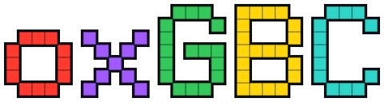

<p align="center">
  <a href="https://github.com/mxmgorin/oxgbc">
    
  </a>
</p>

<p align="center">
  <b>A Game Boy &amp; Game Boy Color emulator written in Rust.</b>
</p>

<p align="center">
  <a href="https://mxmgorin.github.io/oxgbc/"><b>🕹️&nbsp;&nbsp;Play online</b></a>
  &nbsp;&nbsp;&nbsp;
  <a href="https://github.com/mxmgorin/oxgbc/releases/latest"><b>📥&nbsp;&nbsp;Download</b></a>
</p>

---

<div align="center">

[](https://github.com/mxmgorin/oxgbc/actions/workflows/test.yml)
[](https://github.com/mxmgorin/oxgbc/actions/workflows/build-android.yml)
[](https://github.com/mxmgorin/oxgbc/actions/workflows/build-windows.yml)
[](https://github.com/mxmgorin/oxgbc/actions/workflows/build-macos.yml)
[](https://github.com/mxmgorin/oxgbc/actions/workflows/build-linux.yml)
[](https://github.com/mxmgorin/oxgbc/actions/workflows/build-linux-arm.yml)

[](https://github.com/mxmgorin/oxgbc/releases/latest)
[](./LICENSE)
[](https://www.rust-lang.org)
[](https://deps.rs/repo/github/mxmgorin/oxgbc)

</div>

<!-- optional extras (re-enable Downloads once the count is higher):
[](https://github.com/mxmgorin/oxgbc/releases)
[](https://github.com/mxmgorin/oxgbc)
-->

<p align="center">
  <a href="https://raw.githubusercontent.com/mxmgorin/oxgbc/main/media/01bg.gif" target="_blank">
    
  </a>&nbsp;&nbsp;
  <a href="https://raw.githubusercontent.com/mxmgorin/oxgbc/main/media/02bg.gif" target="_blank">
    
  </a>&nbsp;&nbsp;
  <a href="https://raw.githubusercontent.com/mxmgorin/oxgbc/main/media/03bg.gif" target="_blank">
    
  </a>&nbsp;&nbsp;  
  <a href="https://raw.githubusercontent.com/mxmgorin/oxgbc/main/media/pokemoncrystal.gif" target="_blank">
    
  </a>
</p>

`oxGBC` (**ox**ide + **GBC**) is a Game Boy (DMG) and Game Boy Color (CGB) emulator written in Rust. It is built around a single portable emulation core that powers Windows, macOS, Linux, Android, and WebAssembly builds. The emulator aims for high accuracy through sub-instruction CPU timing, dot-level PPU emulation, and cycle-synchronized subsystems, while providing modern features such as save states, rewind, shaders, and configurable controls.

***Work in progress**: while most games run correctly, some issues may still occur.*

## Accuracy & Testing

The emulator is continuously validated against community made test suites which are executed on CI via `cargo test`:

- **Blargg** – Passes all tests
- **Mooneye** – Passes most of the tests
- **Visual** - Passes the DMG-acid2, CGB-acid2, Mangen

For the complete results, see [TESTS.md](./docs/TESTS.md).

## Features

**Gameplay**

- **Save States** — Multiple save slots with optional automatic save and restore
- **Rewind** — Configurable rewind for undoing gameplay actions
- **Speed Control** — Adjustable emulation speed with configurable Slow and Turbo modes
- **Custom Controls** — Fully rebindable controls with support for button combinations

**Video & Rendering**

- **Rendering Backends** — SDL2 software renderer with an optional OpenGL backend supporting GLSL shaders
- **Visual Filters** — Grid, subpixel, scanline, dot-matrix, and vignette effects
- **Frame Blending** — Configurable LCD ghosting simulation with multiple blending modes
- **Palettes** — Multiple built-in palettes with support for user-defined palettes via `palettes.json`

**Interface & Tooling**

- **GUI & Configuration** — Full graphical configuration with optional manual editing of `config.json`
- **Built-in File Browser** — Browse and launch ROMs directly from the emulator
- **ROM Library** — Automatic ROM directory scanning with menu-based launching
- **WebAssembly Build** — Runs entirely in the browser with no installation required
- **Tile Viewer** — Real-time inspection of background and sprite tiles (SDL2 renderer)

**Emulation**

- **CPU** — Sharp LR35902 with sub-instruction timing
- **PPU** — Dot-level LCD controller emulation synchronized with the CPU
- **APU** — All four Game Boy audio channels
- **Cartridge Hardware** — MBC0, MBC1, MBC1M, MBC2, MBC3, and MBC5
- **Real-Time Clock** — Battery-backed MBC3 RTC
- **Battery-backed SRAM** — Persistent cartridge save data

## 🎮 Controls

<details>
<summary><b>Default control mappings</b> (click to expand)</summary>

| Action                           | ⌨️ Keyboard              | 🎮 Gamepad                                 |
| -------------------------------- | ------------------------ | ------------------------------------------ |
| D-pad Up                         | Arrow Up                 | D-pad Up                                   |
| D-pad Down                       | Arrow Down               | D-pad Down                                 |
| D-pad Left                       | Arrow Left               | D-pad Left                                 |
| D-pad Right                      | Arrow Right              | D-pad Right                                |
| B                                | Z                        | B                                          |
| A                                | X                        | A                                          |
| Start                            | Enter or S               | Start                                      |
| Select                           | Backspace or A           | Select                                     |
| Rewind (hold)                    | R                        | Y                                          |
| Turbo mode (hold)                | Tab                      | RB                                         |
| Slow mode (hold)                 | Space                    | LB                                         |
| Main menu                        | Esc or Q                 | Select + Start                             |
| Screen scale Up and Down         | + (Equals) and - (Minus) |                                            |
| Fullscreen Toggle                | F11                      |                                            |
| Mute audio                       | M                        |                                            |
| Invert palette                   | I                        | Select + X                                 |
| Next palette                     | P                        | X                                          |
| Load save state (1–4)            | F1–F4                    | RT or Select + RB                          |
| Create save state (1–9)          | 1–9                      | LT or Select + LB                          |
| Volume Up and Down               | PageUp and PageDown      | Start + D-pad Up and Start + D-pad Down    |
| Prev and Next Save State Slot    |                          | Start + D-pad Right and Start + D-pad Left |
| Prev and Next Shader             | [ and ]                  | Select + B and Select + A                  |
| Pause/Stepping mode              | F5                       |                                            |
| Step frame                       | F6                       |                                            |
| Step scanline                    | F7                       |                                            |
| Clear screen                     | F10                      |                                            |
| Toggle debugger (In debug build) | ~                        |                                            |

</details>

## 📦 Installing

Grab the latest build for your platform — Windows, macOS, Linux (x86-64 and
ARM for retro handhelds), or Android — from the
[**Releases**](https://github.com/mxmgorin/oxgbc/releases/latest) page, or
[**play online**](https://mxmgorin.github.io/oxgbc/) with nothing to install.

### macOS first launch

Because the app is only ad-hoc signed (no paid Apple Developer ID), Gatekeeper
blocks the first launch with an *"unidentified developer"* warning. To open it:

- **macOS 15 (Sequoia) and later:** go to **System Settings → Privacy &
  Security**, scroll to the message about oxGBC, and click **Open Anyway**.
- **macOS 14 (Sonoma) and earlier:** right-click oxGBC → **Open** → **Open**.

Or clear the quarantine flag from a terminal (works on every version):

```bash
xattr -dr com.apple.quarantine /Applications/oxGBC.app
```

## 🛠️ Building

First, make sure you have Rust installed. If you don't, install it with:

```
curl --proto '=https' --tlsv1.2 -sSf https://sh.rustup.rs | sh
```

Then install the SDL2 development libraries for your platform:

```bash
# Arch Linux
sudo pacman -S sdl2

# Debian / Ubuntu
sudo apt install libsdl2-dev

# Fedora
sudo dnf install SDL2-devel

# macOS (Homebrew)
brew install sdl2
```

> No system SDL2 (e.g. Windows)? Compile it from source with the bundled feature:
> `cargo build --release -p desktop --features sdl2-bundled`

After that, build the release binary:

```bash
cargo build --release
```

## Running

Launch with a ROM:

```bash
cargo run --release -p desktop -- path/to/game.gb
```

Or run without arguments and use the built-in file browser / ROM scanner to pick a game from the GUI:

```bash
cargo run --release -p desktop
```

## Contributing

Bug reports, and feature requests are welcome. If a game
misbehaves, please [open an issue](https://github.com/mxmgorin/oxgbc/issues)
with the ROM title and what went wrong — accuracy reports are especially
valuable.

## License

This project is licensed under the terms of the **GNU General Public License v3.0 (GPLv3)**.
See the [LICENSE](LICENSE) file for the full text.

## References

Here are some useful resources for Game Boy development and emulation:

- [Game Boy Complete Technical Reference](https://gbdev.io/pandocs/)
- [Gekkio's Complete Technical Reference](https://gekkio.fi/files/gb-docs/gbctr.pdf)
- [Game Boy CPU Opcodes](https://www.pastraiser.com/cpu/gameboy/gameboy_opcodes.html)
- [Gbops, an accurate opcode table for the Game Boy](https://izik1.github.io/gbops/index.html)
- [RGBDS GBZ80 Assembly Documentation](https://rgbds.gbdev.io/docs/v0.9.0/gbz80.7)
- [A curated list of Game Boy development resources](https://github.com/gbdev/awesome-gbdev)

## Acknowledgments

This project makes use of the following resources:

- [SM83 Tests](https://github.com/SingleStepTests/sm83) - CPU instruction tests
- [GB Test ROMs](https://github.com/retrio/gb-test-roms) - general accuracy tests
- [mooneye test suite](https://github.com/Gekkio/mooneye-test-suite) - general accuracy tests
- [DMG acid2 test](https://github.com/mattcurrie/dmg-acid2) - PPU testing for DMG
- [CGB acid2 test](https://github.com/mattcurrie/cgb-acid2) - PPU testing for CGB
- [MagenTests](https://github.com/alloncm/MagenTests) - PPU testing for DMG and CGB
- [Game Boy test roms](https://github.com/c-sp/game-boy-test-roms) - various test roms
- [SameBoy](https://github.com/LIJI32/SameBoy) - shaders (modified for compatibility with GLES)

The web demo bundles open-source homebrew games and test ROMs — see [ROM credits & licenses](crates/web/assets/README.md).
